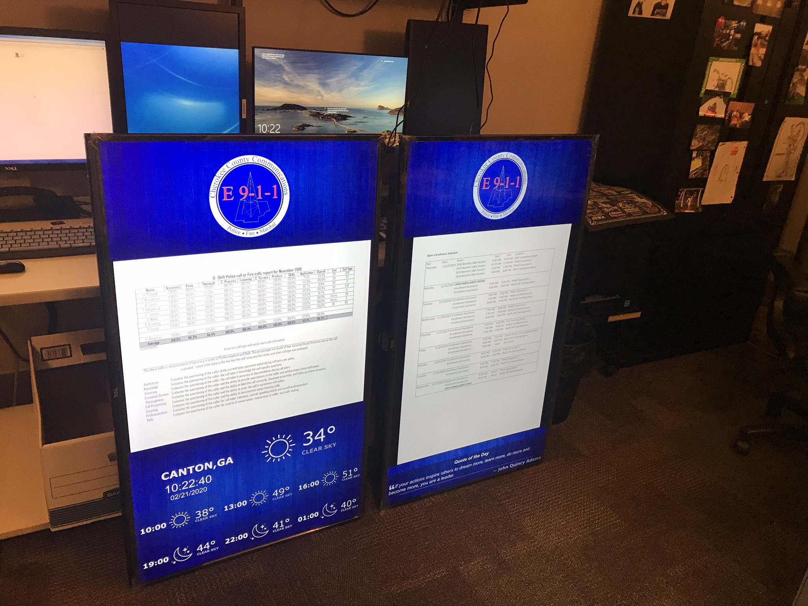
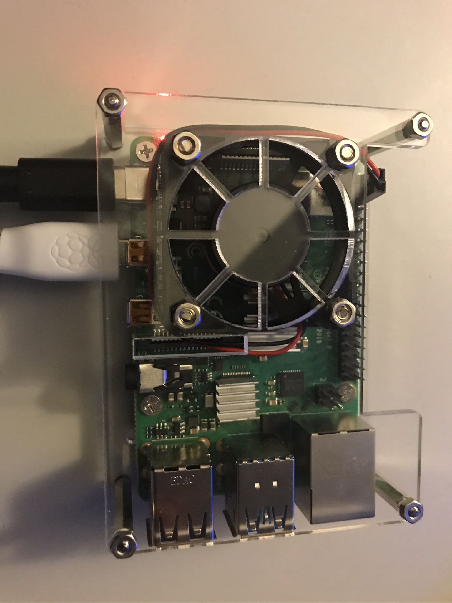
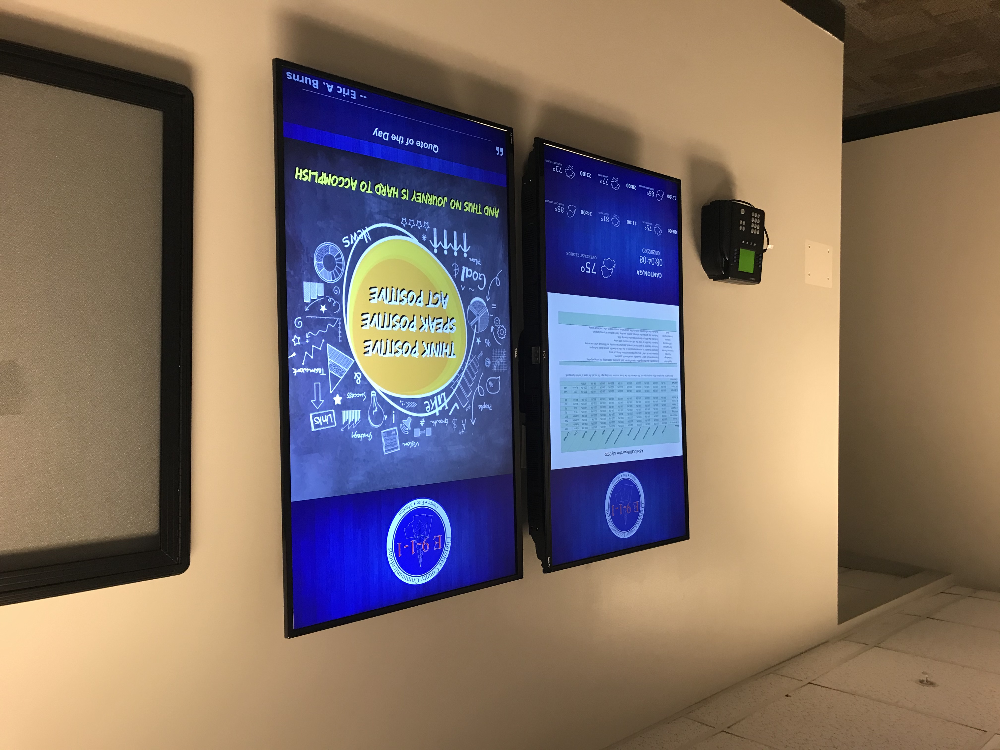

## Welcome to my Digital Billboard project!

Our organization wanted an inexpensive solution for displaying alerts, events and required posted reports. More details and photos coming soon.

Materials Used: 
Raspberry Pi 4 (2GB), one for each screen 
TCL 50" 4K TV 
16GB SD Card 
Case with Fan https://www.microcenter.com/product/610384/micro-connectors-acrylic-stackable-raspberry-pi-4-case-with-power-adapter-and-fan

Software: 
YoDeck https://www.yodeck.com/

